# etl-designer-server

 **作者今年公司事情繁多，暂无精力更新迭代，待2024年上半年辞职后推出改款升级版本，敬请期待。** 

基于Pentaho data-integration产品(kettle)二次开发，精选近50种常用组件进行重写，
涵盖关系型数据库、网络服务、NoSQL数据库,将图形化设计由C/S架构升级为B/S架构，
脱离客户端束缚，随时随地修改脚本,添加定时调度、项目管理、版本控制、发布回滚、
日志追踪、性能监控等丰富实用的功能,新恩数造支持MySQL、Oracle、PostgreSQL、
SqlServer、DB2等关系型数据库在内的多种数据库。
新增BI图表设计功能，包括模型(数据库表)定义,模型脚本自动创建，图表设计，布局
设计，大屏展示

系统运行强制依赖：

redis： 1、缓存找回密码的动态验证码；2、最小成本注册dubbo服务

ftp服务：需连接ftp服务器，用于存放etl运行的脚本，worker执行脚本时，会从ftp服务器拉取最新文件，本地开发时可使用docker启动ftp服务器，数据迁移时，需将ftp内目录完整迁移至其他环境

docker-compose参见目录中的ftp-docker-compose.yml文件

web-server:用于设计转换与任务的服务
worker:用于执行web-server端发布的Job服务

作者 
jesse.18@163.com 
用户名: jesse.18@163.com
密码: 123456 (请勿修改)

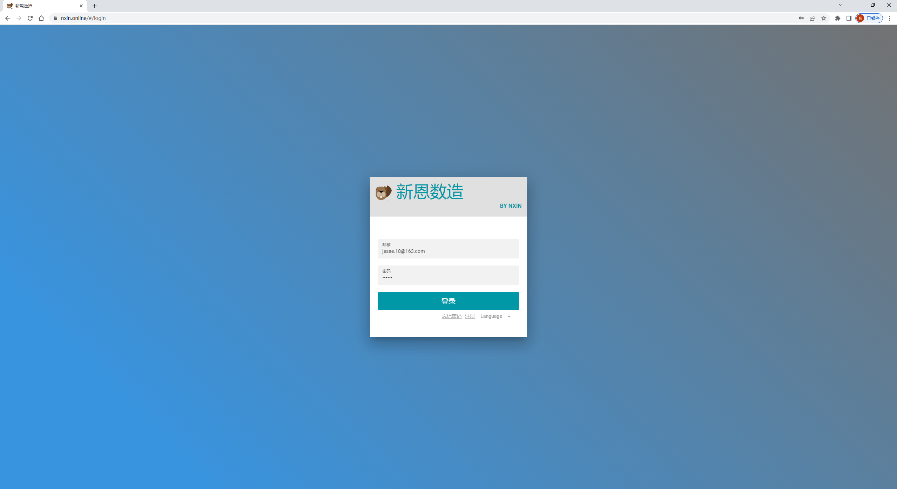
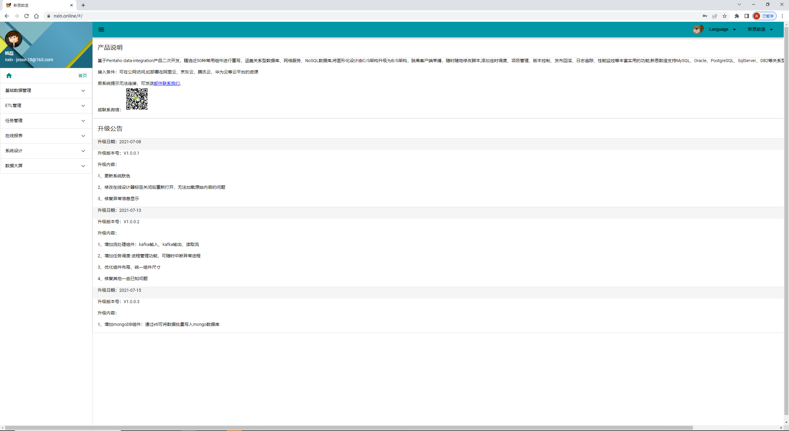
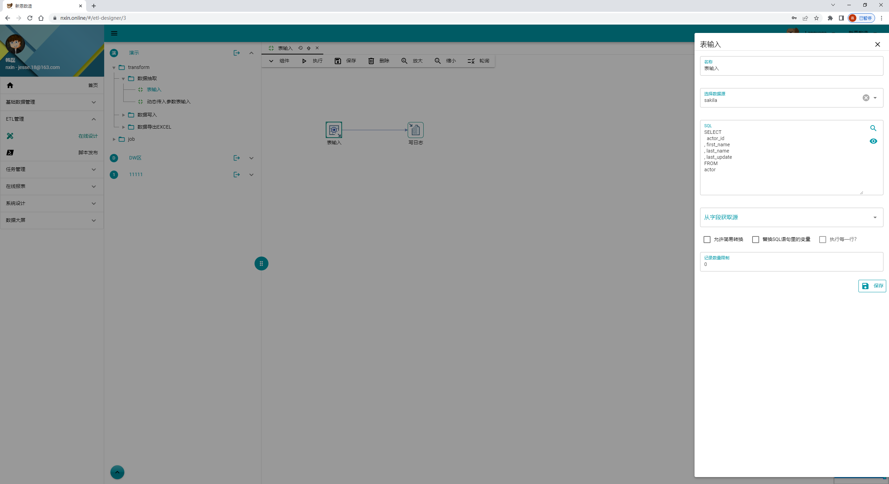
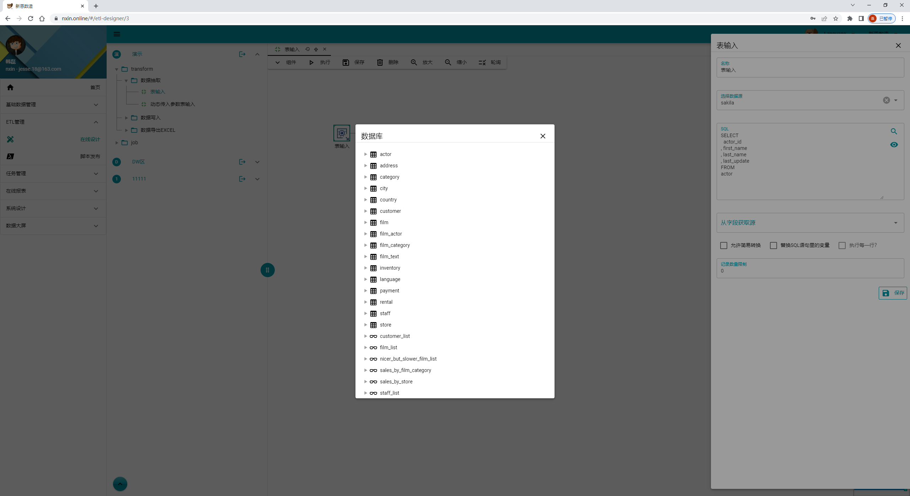
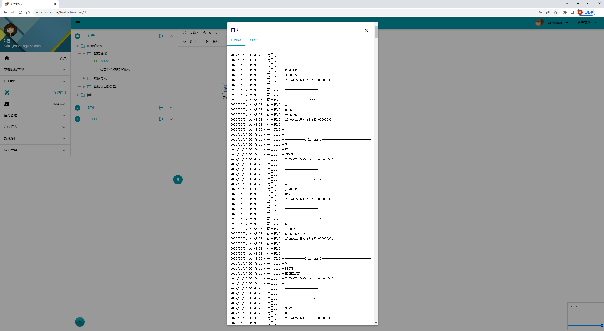
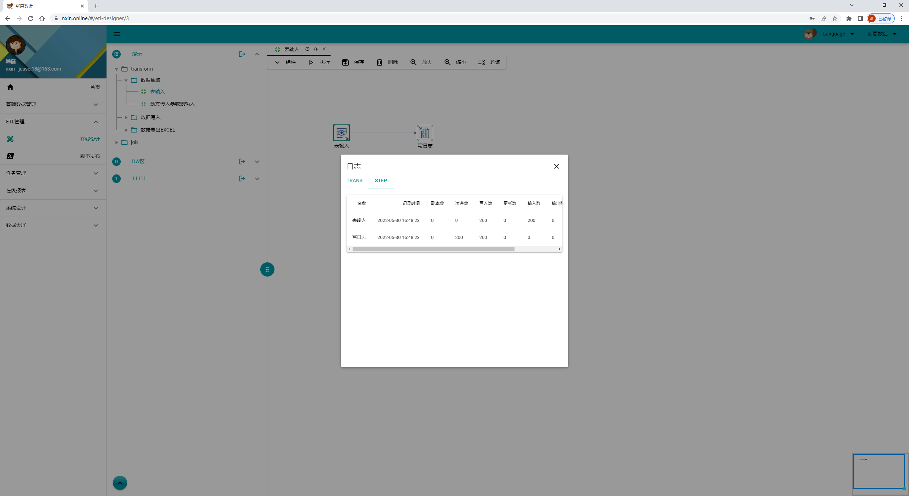
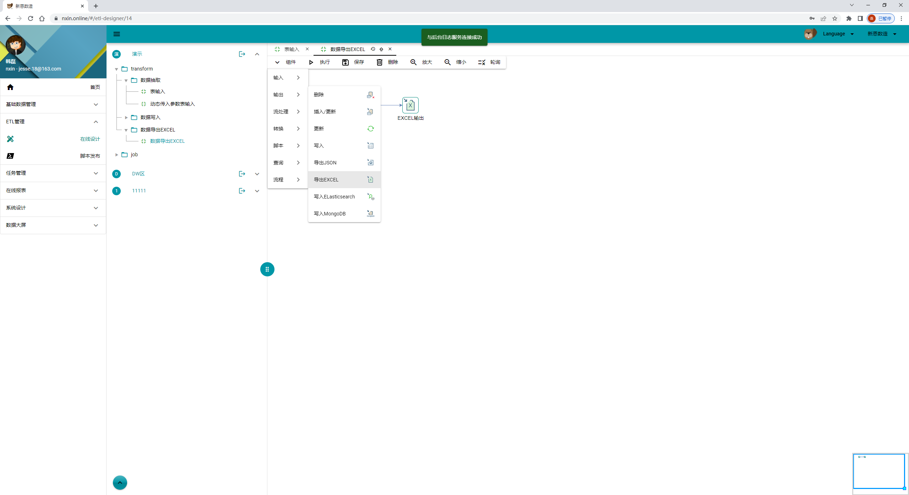
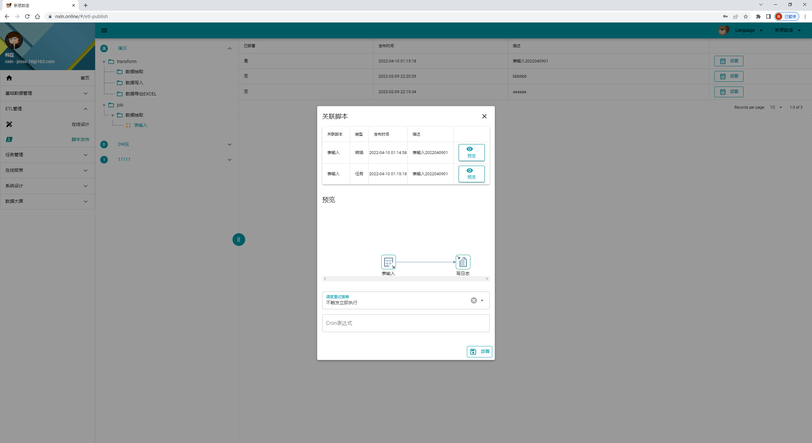
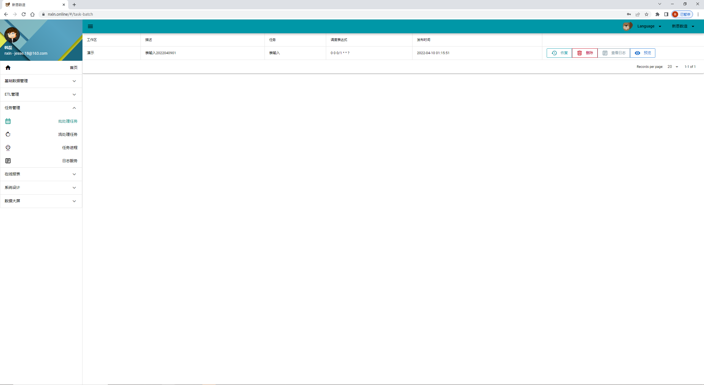
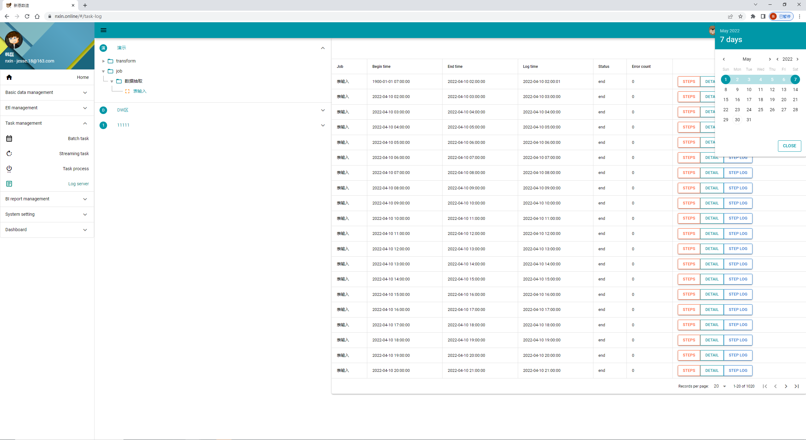
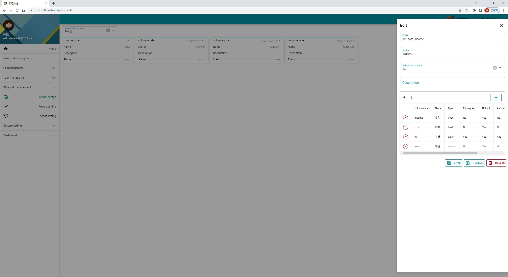
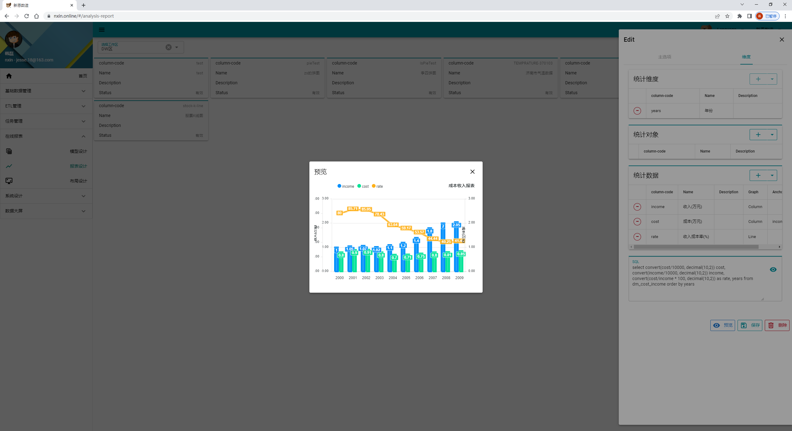
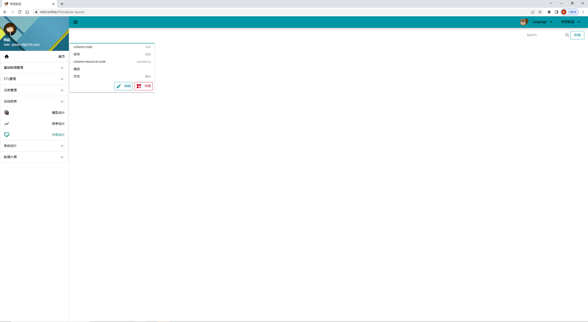
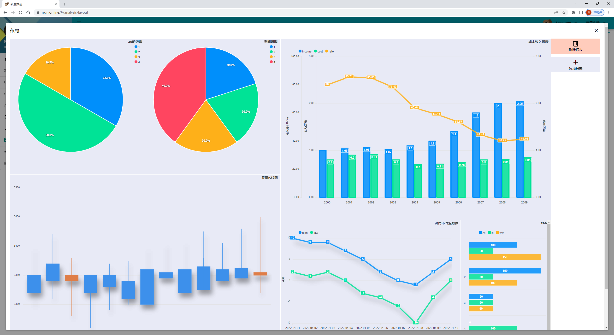
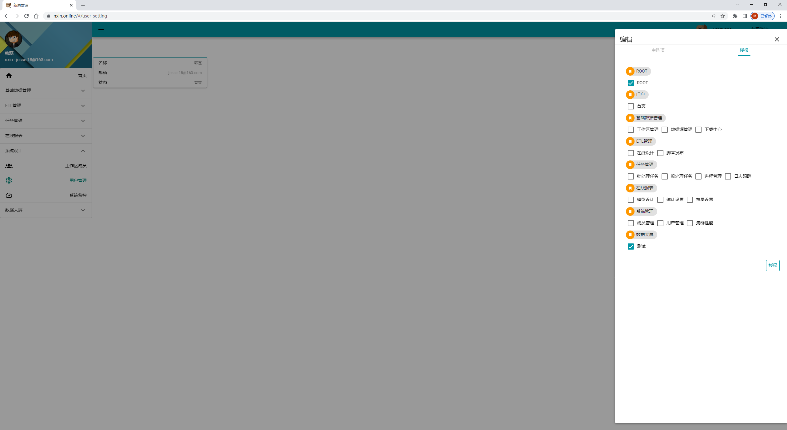
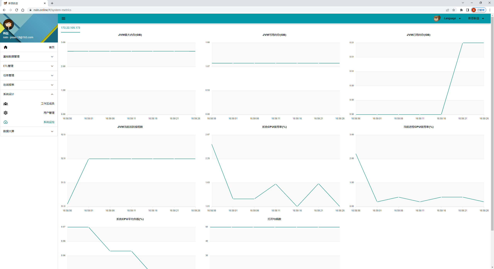
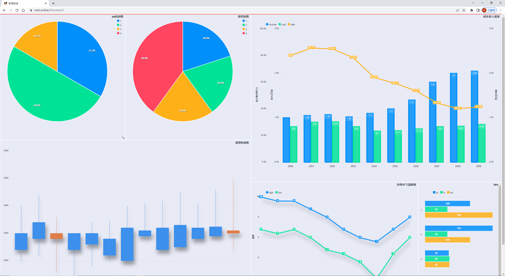